# 手把手教你用cursor给博客加个AI助手：VitePress + Cloudflare Workers + Gemini实战

> 🤔 你是否想过，在浏览博客时能随时和AI聊两句？今天就教你如何通过与cursor对话，在VitePress博客上加个智能助手，让读者能随时和AI对话~

## 🌟 开发灵感
Cursor 是一款强大的代码编辑器，它内置了基于 AI 的聊天和代码生成功能。其中:

**Chat 模式** 允许你像和真人对话一样，用自然语言向 AI 提问编程问题、寻求代码建议，甚至让 AI 直接帮你生成代码片段。

**Composer 模式** 则更进一步，它允许你在编辑器中通过自然语言指令，让 AI 帮你完成更复杂的编程任务，例如重构代码、添加注释、甚至生成整个函数或组件。

正是 Cursor 的这种自然语言编程能力，给了我灵感，尝试完全通过对话的方式来开发这个 AI 助手功能。

说干就干，这就带大家一步步实现这个功能。

## 🎯 需求分析

参考Kimi、智谱AI等游览器AI助手插件，我们的AI助手需要具备以下特点：

1. **随叫随到**：放在右下角，随时可唤出
2. **高智商**：可以接入Gemini大模型，回答要专业、迅速
3. **颜值在线**：回答的内容显示支持Markdown渲染、代码高亮
4. **有记性**：能记住上下文，聊天更连贯
5. **安全可靠**：API密钥要保护好

## 💡 技术选型

最终选定了这套技术栈：

- **前端**：Vue 3 + VitePress（已有的博客框架）
- **后端**：Cloudflare Workers（又轻量又免费，何乐不为）
- **AI模型**：Google Gemini-2.0-Flash（性价比高，响应快），其他模型也可以通过跟换api来实现。
- **工具库**：
  - markdown-it：渲染Markdown
  - highlight.js：代码高亮

其中选择Cloudflare Workers 的原因是：

- **轻量级后端服务**：对于个人博客这种轻量应用来说，Cloudflare Workers 提供的 Serverless 函数非常适合作为 API 的后端，无需复杂的服务器配置和维护。
- **免费额度**：Cloudflare Workers 提供了一定的免费额度，对于个人项目来说非常友好，可以节省服务器成本。
- **快速部署**：Cloudflare Workers 的部署非常简单快捷，可以快速上线服务。
- **安全性**：将 API 密钥等敏感信息放在后端服务中，可以避免直接暴露在前端代码中，提高安全性。

## 给Cursor Composer的提示词

以下是我提供给cursor的prompt：

::: tip
请为我的 VitePress 博客创建一个 Vue 3 组件，名为 `AIChatWidget.vue`，实现一个 AI 聊天助手。这个助手需要：

1.  **集成 Gemini API**：使用 Google 的 Gemini 大语言模型来提供智能回复。后端服务可以使用 Cloudflare Workers 来处理 API 调用。
2.  **用户界面**：在博客页面的右下角创建一个悬浮的聊天助手图标，点击图标可以展开聊天窗口。聊天窗口应包含消息显示区域和用户输入区域。
3.  **消息展示**：聊天消息需要支持 Markdown 格式渲染，并且能够高亮显示代码块。可以使用 `markdown-it` 和 `highlight.js` 这两个库来实现。
4.  **上下文管理**：助手应该能够记住之前的对话上下文，以便进行更连贯的对话。
5.  **聊天记录持久化**：用户的聊天记录应该能够保存在本地存储 (`localStorage`) 中，这样用户下次访问博客时可以看到之前的聊天记录。

请生成 `AIChatWidget.vue` 组件的完整代码，包括模板、脚本和样式部分。
:::

## 🛠️ 开发实战

### 1. 组件结构设计

首先规划一下文件结构：

```
.
├── .vitepress/
│   ├── components/
│   │   └── AIChatWidget.vue    # 对话组件主体
│   └── theme/
│       └── index.js           # 主题配置
└── workers/
    └── AI_Perspective_worker.js # 后端服务
```

## 🔄 完整工作流程

### 1. 前后端交互流程

```mermaid
graph LR
    A[用户输入] --> B[前端组件]
    B --> C[Cloudflare Worker]
    C --> D[Gemini API]
    D --> C
    C --> B
    B --> E[渲染回复]
```



整个对话过程是这样的：
1. 用户在输入框输入问题
2. 前端收集历史消息，发送到Worker
3. Worker处理消息并调用Gemini API
4. 获得回复后，经过Worker返回前端
5. 前端渲染Markdown格式的回复

### 2. 核心代码解析

#### 前端消息处理
```vue
<!-- AIChatWidget.vue -->
<script setup>
const messages = ref([
  { role: 'assistant', content: '你好！我是你的 AI 助手，有什么我可以帮你的吗？' }
])

const sendMessage = async () => {
  if (!userInput.value.trim() || isLoading.value) return
  
  // 1. 添加用户消息
  messages.value.push({ role: 'user', content: userInput.value.trim() })
  userInput.value = ''
  
  // 2. 发送到Worker
  const response = await fetch(`${WORKER_URL}/api/chat`, {
    method: 'POST',
    headers: { 'Content-Type': 'application/json' },
    body: JSON.stringify({ messages: messages.value })
  })
  
  // 3. 处理响应
  const data = await response.json()
  messages.value.push({ 
    role: 'assistant', 
    content: data.candidates[0].content.parts[0].text 
  })
}
</script>
```

#### Worker端处理
```javascript
// AI_Perspective_worker.js
async function handleGeminiChat(request, env) {
  // 1. 获取对话历史
  const { messages } = await request.json()
  
  // 2. 转换格式
  const contents = messages.map(msg => ({
    role: msg.role === 'user' ? 'user' : 'model',
    parts: [{ text: msg.content }]
  }))
  
  // 3. 调用Gemini
  const response = await fetch(
    `https://generativelanguage.googleapis.com/v1beta/models/gemini-pro:generateContent?key=${env.GEMINI_API_KEY}`,
    {
      method: 'POST',
      headers: { 'Content-Type': 'application/json' },
      body: JSON.stringify({
        contents,
        generationConfig: {
          temperature: 0.3,
          maxOutputTokens: 10000
        }
      })
    }
  )
  
  // 4. 返回结果
  return new Response(await response.json(), {
    headers: {
      'Content-Type': 'application/json',
      'Access-Control-Allow-Origin': '*'
    }
  })
}
```

### 3. 配置注意事项

1. **环境变量配置**
```bash
# 开发环境 (.dev.vars)
GEMINI_API_KEY=your-key
VITE_WORKER_URL=http://localhost:8787

# 生产环境
wrangler secret put GEMINI_API_KEY
VITE_WORKER_PROD_URL=https://your-worker.workers.dev
```

2. **CORS配置**
```javascript
// Worker中必须处理OPTIONS请求
if (request.method === 'OPTIONS') {
  return new Response(null, {
    headers: {
      'Access-Control-Allow-Origin': '*',
      'Access-Control-Allow-Methods': 'GET, POST, OPTIONS',
      'Access-Control-Allow-Headers': 'Content-Type'
    }
  })
}
```

3. **错误处理**
```javascript
try {
  // API调用
} catch (error) {
  console.error('Error:', error)
  return new Response(
    JSON.stringify({ 
      error: '服务器开小差了，请稍后再试~',
      details: env.DEBUG ? error.stack : undefined 
    }),
    { status: 500 }
  )
}
```

## 🎨 样式美化

### 1. 响应式设计

```css
/* 在手机上自动调整大小 */
@media (max-width: 768px) {
  .chat-window {
    width: calc(100vw - 40px);
    height: calc(100vh - 100px);
  }
}
```

### 2. 暗色主题适配

```css
/* 暗色模式下的配色 */
.dark .message-content {
  background: var(--vp-c-bg-soft);
  color: var(--vp-c-text-1);
}
```

## 🚀 踩坑记录

开发过程中也遇到了不少坑，分享几个典型的：

1. **API认证问题**
```javascript
// ❌ 错误写法
headers: {
  'Authorization': `Bearer ${env.GEMINI_API_KEY}`
}

// ✅ 正确写法
const apiUrl = `https://generativelanguage.googleapis.com/v1beta/models/gemini-pro:generateContent?key=${env.GEMINI_API_KEY}`;
```

2. **环境变量配置**
```bash
# 开发环境：用.dev.vars
echo "GEMINI_API_KEY=your-key" > .dev.vars

# 生产环境：用wrangler
wrangler secret put GEMINI_API_KEY
```

## 🌈 效果展示

完成后的效果是这样的：
- 右下角悬浮一个小机器人图标
- 点击展开对话窗口
- 支持Markdown格式化
- 代码自动高亮
- 记住上下文对话
- 手机端完美适配


## 🚀 优化方向

基于现有代码，我们还可以做这些改进：

### 1. 性能优化
- **消息节流**：避免用户快速发送大量消息
```javascript
const throttledSend = useThrottle(sendMessage, 1000)
```

- **消息缓存**：缓存常见问题的回答
```javascript
const messageCache = new Map()
if (messageCache.has(question)) {
  return messageCache.get(question)
}
```

### 2. 用户体验
- **打字机效果**：逐字显示AI回复
```vue
<script setup>
const typeWriter = (text, element) => {
  let i = 0
  const speed = 50
  function type() {
    if (i < text.length) {
      element.textContent += text.charAt(i)
      i++
      setTimeout(type, speed)
    }
  }
  type()
}
</script>
```

- **语音输入**：支持语音识别
```javascript
const startVoiceInput = async () => {
  const recognition = new webkitSpeechRecognition()
  recognition.lang = 'zh-CN'
  recognition.onresult = (event) => {
    userInput.value = event.results[0][0].transcript
  }
  recognition.start()
}
```

### 3. 功能扩展
- **上下文长度控制**：避免历史消息过长
```javascript
const MAX_CONTEXT_LENGTH = 10
if (messages.value.length > MAX_CONTEXT_LENGTH) {
  messages.value = messages.value.slice(-MAX_CONTEXT_LENGTH)
}
```

- **消息持久化**：保存聊天记录
```javascript
const saveChat = async () => {
  localStorage.setItem('chatHistory', JSON.stringify(messages.value))
}

onMounted(() => {
  const history = localStorage.getItem('chatHistory')
  if (history) {
    messages.value = JSON.parse(history)
  }
})
```

- **主题定制**：支持自定义主题
```javascript
const themes = {
  light: {
    background: '#ffffff',
    text: '#333333'
  },
  dark: {
    background: '#1a1a1a',
    text: '#ffffff'
  }
}

const applyTheme = (theme) => {
  Object.entries(themes[theme]).forEach(([key, value]) => {
    document.documentElement.style.setProperty(`--theme-${key}`, value)
  })
}
```
## 📝 总结

通过这次开发，我们实现了一个完整的AI助手功能。不仅让博客更智能了，还学到了很多技术要点：

- Vue组件开发
- Serverless服务
- API对接
- 用户体验优化

> 小贴士：记得保护好你的API密钥哦，千万别直接写在代码里！😉

## 🔗 参考资源

- [Gemini API文档](https://ai.google.dev/docs)
- [Cloudflare Workers文档](https://developers.cloudflare.com/workers/)
- [VitePress文档](https://vitepress.dev/)


