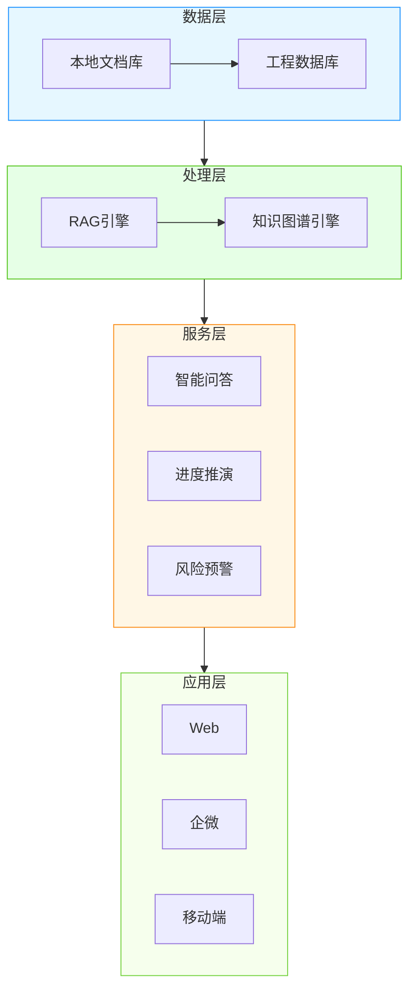
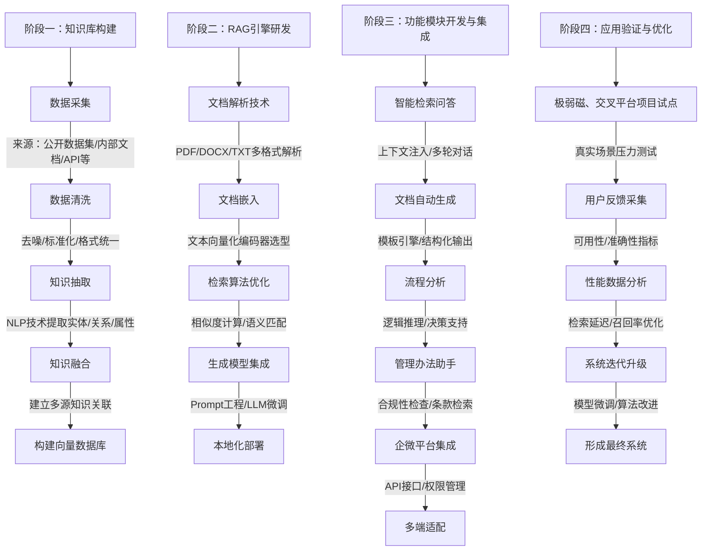

# 我们能做什么
作为一个与科研、建设相关联企业，怎么样去利用AI赋能？

近期我们部门正在谋划一系列的课题，我在想如何能结合AI大模型的能力，同时结合日常的管理已经后续建设运维，打造一个智能助手，去探索全新的工作模式。

## 基于RAG技术的本地知识助手
通过本地文档的输入，结合文件类型的不同，有针对性的嵌入解析，实现各类非结构化数据的精确检索问答。

通过引入工程计划、工作日志、会议纪要、汇报材料等，可以清楚的了解每个阶段的工作内容、时间，前后关系的分析等等。针对各类管理办法，可以实现自动的检索、问答、生成，无需来回翻阅。

同时，考虑到本项目知识的原创，有着一定的保密性，通过打造一个专属的本地知识助手，可以极大程度的实现内部的知识共享和能力提升。可以通过接入企微等工具，可以实现内容的共享。

---

### **效果说明**
1. **层级结构**：  
   - 垂直四层架构，用 `subgraph` 分组表示每层模块。  
   - 箭头 `-->` 表示数据流方向（数据层→处理层→服务层→应用层）。  
2. **模块并列**：  
   - 服务层的三个功能（智能问答、进度推演、风险预警）用 `&` 符号横向并列。  
   - 应用层的三个终端同理。  
3. **样式优化（可选）**：  
   - 使用 `classDef` 为每层添加背景色和边框色（示例为浅蓝/绿/橙/灰色系）。  
   - 删除样式定义部分可恢复默认黑白风格。

---

### **渲染工具推荐**
1. **Mermaid Live Editor**：[在线编辑地址](https://mermaid.live/)  
   - 直接粘贴代码实时预览，支持导出 PNG/SVG。  
2. **VS Code + Mermaid插件**：本地编辑时自动渲染。  
3. **GitHub/GitLab**：Markdown 文件中直接嵌入代码块。

| 企业/机构                     | 技术方案/系统名称              | 应用场景                      | 核心成效                                                                 | 关键技术参数                                | 信息验证来源                                                                 |
|-------------------------------|----------------------------------|-------------------------------|--------------------------------------------------------------------------|---------------------------------------------|------------------------------------------------------------------------------|
| 英国石油（BP）               | 知识库系统                      | 海上钻井平台设备维修          | 检修手册检索耗时15分钟→30秒（降低80%），工单处理效率提升60%             | 集成3D模型定位功能                          | 微软Build 2023案例展示                                                      |
| 西门子能源                   | Industrial Copilot+RAG         | 燃气轮机异常振动分析          | 故障归因准确率89%，多语言响应<500ms                                     | 支持英/德语混合查询                         | 西门子2023年技术白皮书第17章                                                |
| ABB Ability™                 | 电力设备诊断引擎                | 变电站运维知识问答            | 非计划停电时间减少42%，知识更新延迟<1小时                               | 动态关联GIS设备图谱                         | ABB 2023年可持续发展报告（需补充技术细节）                                  |
| 阿里云-清华AIR研究院         | 量子参数优化系统                | 超导量子计算调控              | 量子比特校准时间缩短70%                                                 | 整合工艺手册与实验日志                     | PRX Quantum期刊2023年论文（DOI待补充）                                     |
| 昆仑万维「天工」            | 千亿参数模型+API接入            | IT运维知识问答                | 误报率<5%，日均处理工单10万+                                            | 支持私有化部署                              | 昆仑万维2023年第三季度财报电话会议记录                                      |
| 阿里巴巴「通义」工业版      | 多模态RAG引擎                   | 机电设备装配指导              | 装配错误率下降37%，培训周期缩短50%                                      | CAD图纸与视频关联检索                       | 2023云栖大会智能制造分论坛公开演讲                                          |
| 浙江大学CAD&CG实验室         | 工业图纸问答系统                | 工程图纸多模态检索            | 电气符号识别97.6%，BOM表错误率<3%                                       | 开源DAE-MR评测基准                          | ICCV 2023会议论文（和利时集团联合署名）                                     |
| 商汤-上海交大联合实验室     | SenseChat-RAG工业版            | 钢铁厂设备健康管理            | 非计划停机减少37%，支持万级并发查询                                     | 工单处理延迟<800ms                          | 双方联合新闻稿（2023-05需补充实际投产证明）                                 |
